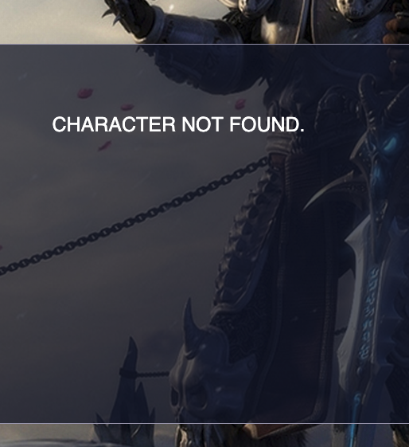

## Blizzard API
This is a web application which makes use of the blizzard api to retrieve a player's stats and equipped items. For each equiped item additional information is being displayed. Users can search for their characters by entering their character username and the name of the realm.
Build using nodejs, express and scss.

The live website can be found [HERE](https://eagle-dreams-demo.herokuapp.com/)

## Usage
- Clone repository
- Navigate to the project folder
- Run `npm start `
- Open localhost

>Instead of running the project you can visit the live website on the link given above

## Implementation
The application before requesting the information, it first requests a token in order for the api requests to be authendicated. Once a token is retrieved requests about the character's stats and equiped items are dispatched. When all the equiped items are fetched an additional request for each item's information is performed. Finally, when all of the information is retrieved approrpiate objects are being created which are send to the client. By opening the console in the browser the object can be viewed. Following some of the functionalities implemented are presented:

Searching for a character:

Character Stats:

Equipped items:

Extra item information on hover:

Invalid information:

404 page response:

